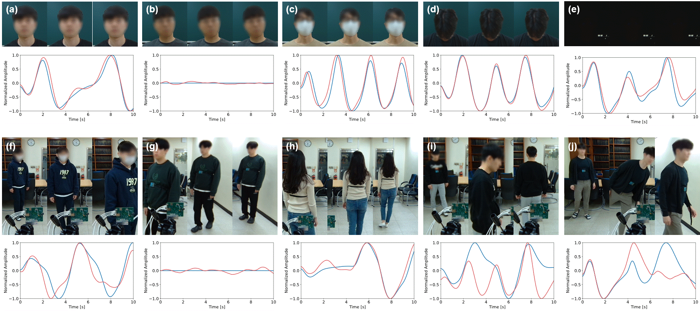

# RRM

*Non-contact respiration rate measurement (nRRM) from a moving person using a mmWave radar*. This is part of the paper: _Remote Respiration Monitoring of Moving Person Using Radio Signals_ published at ECCV'22.

Overview
----------
Non-contact respiration rate measurement (nRRM), which aims to monitor one’s breathing status without any contact with the skin, can be utilized in various remote applications (e.g., telehealth or emergency detection). The existing nRRM approaches mainly analyze fine details from facial videos to extract minute respiration signals; however, they have practical limitations in that the head or body of a subject must be quasi-stationary. In this study, we examine the task of estimating the respiration signal of a non-stationary subject (a person with large body movements or even walking around) based on radio signals. The key idea is that the received radio signals retain both the reflections from human global motion (GM) and respiration in a mixed form, while preserving the GM-only components at the same time. During training, our model leverages a novel multi-task adversarial learning (MTAL) framework to capture the mapping from radio signals to respiration while excluding the GM components in a self-supervised manner. We test the proposed model based on the newly collected and released datasets under real-world conditions. This study is the first realization of the nRRM task for moving/occluded scenarios, and also outperforms the state-of-the-art baselines even when the person sits still.

 

  

Dataset
----------
We collected two types of radio frequency (RF)-based nRRM datasets under the static/moving settings. For acquiring RF data, we utilized a commercial FMCW radar (IWR1443BOOST, Texas Instruments Inc.) operating in the 77 GHz frequency band with a 1000 pulse repetition frequency. To download the dataset, please visit the following **[GoogleDrive](https://)**.
